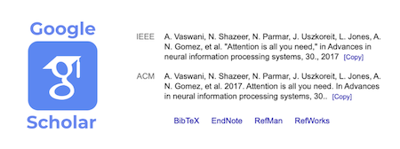

# Google Scholar IEEE/ACM Citation Extension

A lightweight Chrome Extension that adds **IEEE** and **ACM** citation formats directly to the Google Scholar "Cite" modal.



## Features

- **Instant Injection**: Automatically adds "IEEE" and "ACM" rows to the citation modal.
- **Global Copy Buttons**: Adds a convenient `[Copy]` button to **ALL** standard formats (APA, MLA, Chicago, Harvard, Vancouver, etc.) and the new IEEE/ACM rows.
- **Privacy-Focused & Robust**: Uses local parsing of APA/MLA data directly from the screen. Zero external API calls, meaning no 403 errors or CAPTCHA blocks.
- **Native UI**: Perfectly aligns with Google Scholar's existing table layout (`tr`/`th`/`td`) for a seamless look.

## Installation

This extension is built with **Manifest V3**.

1.  **Download** or **Clone** this repository to your computer.
    ```bash
    git clone https://github.com/yourusername/google-scholar-ieee-acm.git
    ```
2.  Open Google Chrome and navigate to `chrome://extensions/`.
3.  Enable **Developer mode** (toggle in the top-right corner).
4.  Click **Load unpacked**.
5.  Select the directory where you cloned this repository.

## Usage

1.  Go to [Google Scholar](https://scholar.google.com).
2.  Search for any paper.
3.  Click the quotation mark symbol (**Cite**) under the result.
4.  You will see **IEEE** and **ACM** appear in the list!

## License

MIT License
